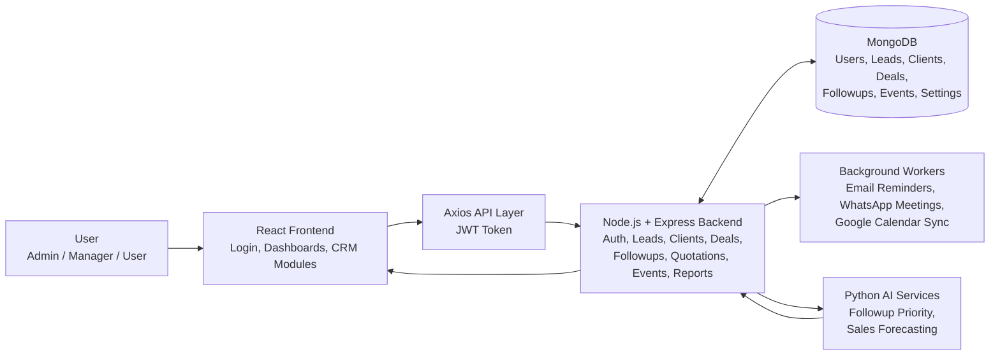

# AI-Based-Sales-CRM

## Simple Project Flow



## Flow Summary

1. Users sign in from the React frontend and access role-based dashboards and CRM modules.
2. The frontend sends requests through Axios to the Express backend using JWT authentication.
3. The backend handles core CRM operations like leads, clients, deals, followups, quotations, events, expenses, and reports.
4. MongoDB stores the main business data and settings used across the system.
5. For smart features, the backend calls Python models for follow-up priority prediction and sales forecasting.
6. Background workers send notifications, WhatsApp reminders, and support calendar-related automation.
## OCR setup

The business-card OCR feature needs a Python environment with the OCR dependencies installed.

Requirements file:

```text
backend/ocr/runtime/requirements.txt
```

Recommended setup on a new machine:

```bash
cd backend/ocr/runtime
python -m venv .venv
.venv\Scripts\activate
pip install -r requirements.txt
```

Then point the backend to that Python if needed:

```bash
OCR_PYTHON_EXEC=backend/ocr/runtime/.venv/Scripts/python.exe
```

Notes:

- If `backend/ocr/runtime/.venv` exists, the backend will try to use it first.
- If OCR dependencies are missing, the backend now stays up and the OCR route returns a clear `503` error instead of crashing the whole server.
- The bundled OCR ML model was trained with a newer scikit-learn pickle format; the runtime now repairs the known `LogisticRegression.multi_class` mismatch automatically during load.
